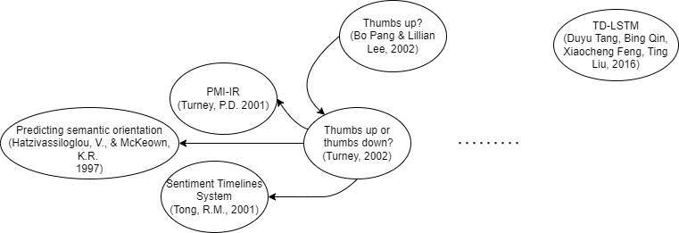

## 常用网址

文献搜索

* [谷歌学术](https://scholar.google.com.hk/?hl=zh-CN)

文献阅读/引用

* [arXiv.org](https://arxiv.org/)
* [scihub1](https://sci-hub.se/), [scihub2](https://sci-hubtw.hkvisa.net/)

文献翻译

* [谷歌翻译](https://translate.google.com/?sl=en&tl=zh-CN&op=translate&hl=zh-CN)
* [一帆文档翻译](https://fanyipdf.com/)（需禁用代理）

## 阅读顺序

- [x] [Thumbs up? Sentiment Classification using Machine Learning Techniques](https://arxiv.org/pdf/cs/0205070)
- [x] [Thumbs Up or Thumbs Down? Semantic Orientation Applied to Unsupervised Classification of Reviews](https://arxiv.org/ftp/cs/papers/0212/0212032.pdf)
- [x] [Effective LSTMs for Target-Dependent Sentiment Classification.](https://arxiv.org/pdf/1512.01100)
- [ ] [Seeing stars: Exploiting class relationships for sentiment categorization with respect to rating scales](https://arxiv.org/pdf/cs/0506075.pdf)
- [ ] [Learning extraction patterns for subjective expressions](http://www.aclweb.org/anthology/W03-1014)
- [ ] [Convolutional Neural Networks for Sentence Classification.](https://arxiv.org/pdf/1408.5882)
- [ ] [TextCNN with Attention for Text Classification](https://arxiv.org/ftp/arxiv/papers/2108/2108.01921.pdf)
- [ ] [Seeing stars when there aren’t many stars: Graph-based semi-supervised learning for sentiment categorization](https://aclanthology.org/W06-3808.pdf)

> Tips:[How to Read a Paper Efficiently (By Prof. Pete Carr)](https://www.youtube.com/watch?v=IeaD0ZaUJ3Y)

## 1-Thumbs up? 

> 这篇基本很可能已经算是情感计算的开山之作了，从过去基于主题的(topic)分类，到作者他们尝试的基于情感(sentiment)的分类。当然，由于算是介绍性质的论文，作者他们应用的算法都很基本，他们这篇论文的关注点也不在于对准确率的提高，而是对情感计算这个问题的初步引入，并且和过去基于主题的文本分类进行对比。

作者首先验证了情感分类和主题分类的不同，并且验证了机器学习算法应用于情感分类是可行的，得到的分类结果会好于人直觉想出的分类标准。在测试的结果中，Naive Bayes表现最差，SVM表现最好，但差别并不显著。

因为是几乎首创性质的领域，baseline是使用的直觉的分类策略设定的。除此以外，在实验过程中得到了两个和主题分类相比显著的不同：

1. 已经验证了的相同的传统机器学习算法在topic categorization和sentiment classification上面的表现差异是明显的，情感分类的准确度均大大低于主题分类的结果
2. 在所有尝试的特征中，竟然只有unigram是有着最好的分类结果的特征，加入特征词汇的频率也不能改善分类结果，这和主题分类中引入特征词汇的频率得到的结果截然相反。

当然，作者通过重新查看语料库对这些问题进行了解释，并用"thwarted  expectations"来描述这一现象，即文本表述中存在的先抑后扬。主要体现在评论性文字中大量的某一情感方面的词汇并不一定是作者真正想表达的内容，换句话讲，评论者可能会先对电影的各方方面面进行批评，但最后的总结却明显表达对这一电影本身的喜爱之情。这一点在电影评论中是相对常见的。

作者最后提出一点可能的未来改进的方向，就是分辨出选用的features，是否是真的在对评价的关注对象在进行描述。

>  Hence, we believe that an important next step is the identification of features indicating whether sentences are on-topic (which is a kind of co-reference problem)

当然，作者在反复的提及Turney他们的工作，等下补充阅读。

## 2-Thumbs up or thumbs down? (Turney, 2002)

作者使用术语*sematic orientation*（我直译为*语义指向*）用来对phrases的情感倾向进行计算，计算原则如下：

* info_a: given phrase <=> mutual info <=> excellent
* info_b: given phrase <=> mutual info <=> poor
* info_a minus info_b

> ..., the semantic orientation of a phrase is calculated as the mutual information between the given phrase and the word “excellent” minus the mutual information between the given phrase and the word “poor”. A review is classified as recommended if the average semantic orientation of its phrases is positive.

目前读到的这两位，基本算是情感计算的开创者，此前虽然也有相关的应用(Tong, 2001)，但Tong本人也没能足够重视情感计算这个领域本身，只是把情感计算作为一种工具。Tong这个有意思的工作应该流传的是相当广泛的，课上老师还提到过她们也做过类似的东西。

> sentiment timelines，根据网络上的评论情感分布，得出不同时间段人们的情感变化曲线

>As far as I know, the only prior published work on the task of classifying reviews as thumbs up or down is Tong’s (2001) **system for generating sentiment timelines**. This system tracks online discussions about movies and displays a plot of the number of positive sentiment and negative sentiment messages over time. Messages are classified
>by looking for specific phrases that indicate the sentiment of the author towards the movie (e.g., “great acting”, “wonderful visuals”, “terrible score”, “uneven editing”). Each phrase must be manually added to a special lexicon and manually tagged as indicating positive or negative sentiment.

至于使用sematic orientation这一术语来对表达的情感进行评估的，还有作者提及的Hatzivassiloglou and McKeown's work (1997)，他们处理的是预测形容词的sematic orientation，被作者评价为与自己的工作最为接近的（在我看来，更多是核心思想上的接近）。Hatzivassiloglou和McKeown的工作，主要是利用给定的4步骤监督学习策略，使用连词来对形容词的语义指向进行推断：

1. 所有的conjunctions of adjectives是从给定语料库中抽取的；
2. 使用监督学习算法绘制出这些成对的形容词的语义指向图，结点为形容词，边标明语义指向是相同的还是不同的(sameness or difference)；
3. 使用聚类算法把相同语义指向的词汇分在同组中，在同一聚类子集中图的边会主要是sameness，贯穿聚类子集的图的边会主要是difference；
4. 由于positive的形容词使用频率会比negative的高，这会导致聚类结果中，使用频率较高的词汇会被认为是有positive的语义指向。

他们形容词分类结果的准确率在78%-92%之间，取决于语料库。而且，由于聚类算法不仅仅是二分类，这一算法还能够得出被分类到特定语义指向的符合度(goodness-of-fit)，所以是很好的结果。

> The algorithm can go beyond a binary positive-negative distinction, because the clustering algorithm (step 3 above) can produce a “goodness-of-fit” measure that indicates how well an adjective fits in its assigned cluster.

作者承认，他们的算法可以被直接应用到评论分类中，但作者小小的赞扬了一下自己2001年提出的PMI-IR算法，表示自己的算法更简单，更容易implement，并且可以处理phrases, adverbs，而不仅仅是isolated adjectives.

> **Todo:** Tong, R.M. 2001. An operational system for detecting and tracking opinions in on-line discussions. Working Notes of the ACM SIGIR 2001 Workshop on Operational Text Classification (pp. 1-6). New York, NY: ACM.
>
> Todo: PMI-IR 算法 Turney, P.D. 2001. Mining the Web for synonyms: PMI-IR versus LSA on TOEFL. Proceedings of the Twelfth European Conference on Machine Learning (pp. 491-502). Berlin: Springer-Verlag.
>
> Todo: Hatzivassiloglou, V., & McKeown, K.R. 1997. Predicting the semantic orientation of adjectives. Proceedings of the 35th Annual Meeting of the ACL and the 8th Conference of the European Chapter of the ACL (pp. 174-181). New Brunswick, NJ: ACL.

先到这里，回到情感计算正题，情感文本分类。

## 3-Effective LSTMs

> Duyu Tang, Bing Qin, Xiaocheng Feng, Ting Liu
>
> Harbin Institute of Technology, Harbin, China
>
> {dytang, qinb, xcfeng, tliu}@ir.hit.edu.cn

> 是秦老师她们2016年的工作，谷歌学术搜索'sentiment classification'排到了第二，引用是六百多

这篇论文是在解决指定描述对象的情感分类问题，主要是使用target-dependent LSTM，以及后续提出的target-connection LSTM，这两种的分类准确度都远高于标准LSTM。老师们在使用模型的时候，是使用的两个LSTM作为整合上下文信息的方式。

> 我暂时没有理解为什么不直接使用bidirectional LSTM，或者对比二者结果。我推测可能的原因是，本文的主要核心是在处理target-dependent的问题，模型的选择时次要的（但我觉得这个说法不够充分，关键是使用双向RNN来处理上下文信息是很容易想到的），也可能只是相同的实现思想，只是老师她们没有专门说。

> Update: 一方面，在后文我补充了读完论文后并且查阅相关资料之后的推断性质的解释是，2015年几乎没有使用过bidirectional LSTM这一术语，2016年才渐渐开始有了Bi-LSTM这一说法，当时老师她们首先想到类似的双向RNN应用到文本分类中也挺合理，另一方面，在课程展示的时候，老师解答了我的疑问“在当时，模型理论迭代更新的很快，几个月模型就会要换一批的程度，只是前后脚的差别”

有个问题是，文中地址和[Duyu Tang](http://ir.hit.edu.cn/~dytang)老师相关的链接已经失效了，重定向到[微软](https://www.microsoft.com/en-us/research/people/dutang/)的也失效了，至少给我提醒的一点是，最好有个自己的博客作为专门的展示渠道，或者使用非学校的第三方如共用的GitHub账号之类的。Word embedding这里的公开仓库，Stanford那边的链接还是有效的，他们的word embedding数据量更大些，结果自然会更好。区分词嵌入预训练模型的数据来源，根本目的是让语义相关的词语具有较高的相似度，数据来源不同的话结果自然是存在着差异的，不同文本环境下，同一个词语的常用含义是会发生改变的。我们人不需要作区分大概只是阅读量够了，但模型训练量想要足够又变成数据量太大训练成本过高的问题了。

> Todo: (Jiang et al., 2011; Dong et al., 2014; Vo and Zhang, 2015)
>
> Long Jiang, Mo Yu, Ming Zhou, Xiaohua Liu, and Tiejun Zhao. 2011. Target-dependent twitter sentiment classification. ACL, 1:151–160.
>
> Duy-Tin Vo and Yue Zhang. 2015. Target-dependent twitter sentiment classification with rich automatic features. IJCAI
>
> Li Dong, Furu Wei, Chuanqi Tan, Duyu Tang, Ming Zhou, and Ke Xu. 2014. Adaptive recursive neural network for target-dependent twitter sentiment classification. In ACL, pages 49–54.

> 我可能需要看一下，文章中提到的用SVM和那些神经网络的做法，具体是解决的什么样的问题，和这篇论文的相关性如何，为什么这篇论文依旧认为处理target-dependent sentiment classification仍然是一个挑战。

> 其实真的感觉人的学习和神经网络的很相似，智力水平不足（模型架构简单）的会欠拟合，训练量过大容易过拟合。

主要是从人自然的阅读方式是要关注上下文信息来判断针对对象的语义的进而引入使用上下文信息来做推断，这是很自然的想法，也是被很广泛利用的。这篇论文是处理RNN的应用，自然后面就会有使用CNN和transformer来搞东西的研究者。只是目前时间有限，不一定有精力读到那些使用和模仿attention机制的网络，但对现在而言应该都算得上是很成熟的技术了。

针对于对象的情感分类，可能难度确实要更大，最好的结果准确率也只有不到72%，相比于最初使用的机器学习方法对整个评论文本进行分类的结果（77%左右）而言，似乎有下降，尽管还没有充分了解，但考虑到技术进步的大趋势，大概率的可能是这一分类问题的困难程度要明显上升了。

细节方面，这篇文章提及了之前有的工作是使用监督学习的方法，但我没有理解为什么这篇文章要专门强调target-dependent sentiment classification仍然是一个困难。主要是我没有理解，这篇文章和所提及的那几篇论文的关系是什么，是改进了已有使用的方法，还是提高了分类的准确度，还是验证了什么猜想，只读到这里我还不能得到很明确的答案。或者说，这篇论文没有之前读的那两篇对自己实现了什么说的那么明确。虽然摘要的地方提及了是最好的，但没有数据的比较确实不是很具体。

> Majority of existing studies build sentiment classifiers with supervised machine learning approach, such as feature based Supported Vector Machine (Jiang et al., 2011) or neural network approaches (Dong et al., 2014; Vo and Zhang, 2015). Despite the effectiveness of these approaches, we argue that target-dependent sentiment classification remains a challenge: how to effectively model the semantic relatedness of a target word with its context words in a sentence.

提及直接将target-dependent features整合到特征里面来使用SVM比较麻烦，那这里应该是实现了一种免于人工标注的方法。很有可能，这篇论文也是相当的早期的结果。

>The model could be trained in an end-to-end way with standard backpropagation, where the loss function is cross-entropy error of supervised sentiment classification.

> Todo: 这需要我去阅读论文搞清楚时间线问题。
>

当然，已经注意到的一个明显的问题是，重复的语句过多，或者就是复制粘贴前后文，虽然有主题的原因，但我觉得这样写也不太合适。可能是英语的原因，我们使用第二语言毕竟没有母语者那么熟悉。不过不是那么重要，读着前面熟悉的话也节省了读者重新理解文章思路的时间

> Todo: 清理出所有前后文混用的部分

```
abstract:
Empirical results show that modeling sentence representation with standard LSTM does not perform well. 

Incorporating target information into LSTM can significantly boost the classification accuracy.

intro:
Empirical results show that the proposed approach without using syntactic parser or external sentiment lexicon obtains state-of-the-art classification accuracy.
In addition, we find that modeling sentence with standard LSTM does not perform well on this target-dependent task. 

Integrating target information into LSTM could significantly improve the classification accuracy.
```

另一个明显的问题是，超链接失效，主要是url，很可能是对于维护的重视程度不够，前面已经提到过，这让读代码变成一件不可能的事情，着实是一个遗憾，尤其是他们那个时候很可能并没有使用深度学习框架，手写的代码完全可以用来学习借鉴。

这篇文章主要是在对三个模型进行对比

>Afterwards, we extend LSTM by considering the target word, obtaining the Target-Dependent Long Short-Term Memory (TD-LSTM) model. Finally, we extend TD-LSTM with target connection, where the semantic relatedness of target with its context words are incorporated.

先简要介绍了RNN的功能，并解释原始RNN存在的问题，然后讲LSTM解决了梯度消失的问题，从而被更广泛的采用。然后老师们用原始LSTM来处理target-dependent的情感分类问题，但这样得到的结果是target-independent的，不符合预期。于是老师们改进出了TD-LSTM和TC-LSTM，都是很小的改动，但我其实很想知道这要怎么改代码，pytorch给的LSTM的结构应该是不能让两个LSTM共用同一个softmax的吧，推测可能是要手写代码，当然，用Bi-LSTM就没有这个问题。

> Update: 当时可能还没有广泛的使用Bi-LSTM

将目标字符串作为最后预测的结果是合理的，这样从直觉上讲是更加充分的利用了信息的。神经网络方法给我的感觉就是，非常具有启发式的特点，能不能被验证取决于最后的实验结果，稍微和传统机器学习的方法有些不同，毕竟更基于数学的推导，比如SVM还是要算拉格朗日乘子求最优化问题的。

> We favor this strategy as we believe that regarding target string as the last unit could better utilize the semantics of target string when using the composed representation for sentiment classification

TD-LSTM基本可以看做就是稍稍改动的Bi-LSTM（或者就是同一个东西的不同提法，我现在尚不确定），能起到效果是我已知的内容。但这个TC-LSTM确实就是很精妙的东西了，训练时即使用了原来词向量本身预训练的结果，又考虑到在当前语境下，target和contexts的关系，或者说*mutual information*（前面两篇论文里面提到的一个术语），这样从直觉上是能够提高分类效果的，而结果验证了这一点，这一部分应该是这篇论文设定最精巧的地方。

> However, we think TD-LSTM is still not good enough because it does not capture the interactions between target word and its contexts.

>Based on the consideration mentioned above, we go one step further and develop a target-connection long short-term memory (TC-LSTM). This model extends TD-LSTM by incorporating an target connection component, which explicitly utilizes the connections between target word and each context word when composing the representation of a sentence.

说实话，我目前不是很理解为什么老师们吧target-independent作为自己论文的核心，我感觉，TC-LSTM才是这篇论文最精巧的地方，也是这篇论文的亮点。但这篇文章却重心是在讲TD-LSTM，也可能是在时间上，这是类似Bi-LSTM首先提出的论文之一，这一点还有待考证。

> Update: 后文读完后我明白了，是训练的相对成本和相对收益的平衡问题，只是前面没有说明，要读完之后才能理解

>When processing a sentence, we split it into three components: target words, preceding context words and following context words. We obtain target vector vtarget by averaging the vectors of words it contains, which has been proven to be simple and effective in representing named entities  (Socher et al., 2013a; Sun et al., 2015). 

读到这里，TC-LSTM的这种做法，其实是过去已经有人提出过的，只是被拿来应用到这个场景中，在除了这种averaging word vectors的做法之外，TC-LSTM就只是在TD-LSTM的基础上修改了输入的维度。具体更详细的averaging word vectors细节可能还要看Socher的论文。

在本文后面提及，做target-dependent的研究并且想到使用word embedding concatenated with feature representations的人并不少。除了本处使用的LSTM，之前已经有SVM使用这一方法来实现target-dependent的情感分类。这里提及了一些研究工作，是使用adaptive recurrent neural network的，从文中简要的解释中，我推测是将激活函数换为使用类似于maxout network那种自学习的函数，这一点需要在读过论文之后才能明确

> adaptive recursive neural network (Dong et al., 2014), whose composition functions are adaptively selected according to the inputs

> Todo: (Dong et al., 2014)。

从表格的数据和老师们的解释可以看到，SVM事实上已经是相当好的模型了，后面使用的各种RNN未必能有好过传统模型的表现。

如果想要复现模型的话，数据源和模型参数，以及训练过程如下（因为源代码无法查阅，目前只能推测）：

* **network:** LSTM * 2 + softmax，现在感觉可以用Bi-LSTM代替原来的做法，只是需要把最后一层出来的隐层张量稍微处理一下，但文章中没有说清楚最后一层是直接拼接还是加在一起或者是其他的什么操作
* **parameter:** randomize the parameters with uniform distribution U(−0.003, 0.003)，这里没有给清楚随机数种子，也没有说明是哪个框架，手写代码应该也需要说numpy的随机数种子或者什么之类的，或者确实不是很重要
* **optimizer:** SGD，这里老师们似乎并没有特别进行选择，直接使用的随机梯度下降（这个时候adam还没有被提出来或者才提出来，但RMSProp之类的应该已经被广泛使用了）
* **learning rate:** 0.01
* **word embedding:** 100-dimensional Glove vector from Twitter

论文没有什么新的公式，主要是在使用过去已经有的研究成果。主要证明的观点是，在不使用lexicon information的情况下，只是用target-dependent的双向LSTM已经能起到比较好的结果。对于未来结合使用lexicon information我也认为会有比较好的结果。现在还缺乏相关论文的阅读。

接下来是在讲Word embedding的事情，但是SSWE已经无法查看了，后面复现只能看看Glove的预训练词向量。

这里解释了为什么主要是在讲TD-LSTM，因为训练成本相对较低而得到的收益很高，非常显著的说明了添加target-dependent信息对于模型学习的影响。我认为这里主要是得出了双向LSTM在情感分析领域有更好的表现的这个结论。

先讲统计结果，然后把一些有意思的现象专门提出来分析，这一点在前面读过的论文中也有这比较明显的表现。文中提及，LSTM容易忽略具体target的信息，而使用整个句子的情感指向作为每一个输入的target的情感指向。TD-LSTM和TC-LSTM都能比较好的表现，能一定程度上学习到前后文的信息，但前面可以看出，训练TC-LSTM的时间成本要比TD-LSTM高多了（3-4.25倍，200维度是4.25倍，100维是3倍）。

>We analyse the error cases that both TD-LSTM and TC-LSTM cannot well handle, and find that 85.4% of the misclassified examples relate to neutral category. The positive instances are rarely misclassified as negative, and vice versa. A example of errors is: “freaky friday on television reminding me to think wtf happened to lindsay lohan, she was such a terrific actress , + my huge crush on haley hudson.”, which is incorrectly predicted as positive towards target “indsay lohan” in both TD-LSTM and TC-LSTM.

(这里为了文明，删掉了原来用来表示惊叹的词汇)，一开始读句子才发现要做的情感分类任务还是挺难的，一个句子中有多个情感对象，他这个句子可能目的就是为了表达某个情感评论，但是中间提到的某些东西可能是不带有情感色彩的，然后这些不带有情感色彩的东西要被作为target，说实话虽然人类仔细点就能做对，这些题目还是挺反人类直觉的。分类错误这些东西我觉得真的算得上是情有可原，到底是不是中立态度本身就稍稍带有主观问题了，文中已经提到，几乎不会有正面和反面被分类错误的情况，这样看来，技术进步的程度相比于最初提出情感分类的时候已经是相当大的飞跃的，这里重新刷新了我对于情感分类的现有成果的认识。

我实在是觉得这类问题真的说不上是需要特别处理的分类错误，但是现在好像确实集中在处理这类问题。。。技术真的是惊为天人。这篇论文本来还是准备尝试训练Attention的，但是没有取得高于普通LSTM的结果，他们推测的原因是语料库过小，不能充分训练模型。之后的相关工作部分和前面Introduction部分基本上是完全一样的，又重新整理再说了一遍。Conclusion过于简洁，以至于不能很好的从简介中得知这篇论文具体讲了什么，我相当于要注意，写论文的摘要和总结，要充分的把自己完成了什么工作写清楚，即使字数稍微多一点，也比要花很多时间读完整篇文章中间的具体阐释才清楚这篇论文在讲什么要好。

但都确实太强了，MSRA就是那个独立出去制作小冰的部门。

> We believe that incorporation lexicon information in TC-LSTM could get further improvement. We leave this as a potential future work.

在谷歌学术上的搜索结果来看，bi-lstm几乎算是2016年才开始被广泛利用，2015年可能有了少量的使用（仅搜索到一篇），还几乎没有这种提法。

## 小结（1-3）



## 相关不熟悉术语

* n-fold cross validation

​	

固定模型结构和当前模型的训练过程（学习率，训练轮数，优化器），更改模型训练的数据集划分，获取最终情况下的训练结果
