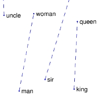
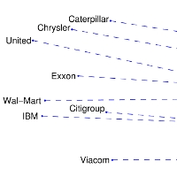
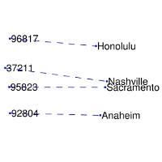

> https://nlp.stanford.edu/projects/glove/

GloVe: Global Vectors for Word Representation [Jeffrey Pennington](http://stanford.edu/~jpennin),  [Richard Socher](http://www.socher.org/),  [Christopher D. Manning](https://nlp.stanford.edu/~manning)

Introduction

GloVe is an unsupervised learning algorithm for obtaining vector representations for words. Training is performed on aggregated global word-word co-occurrence statistics from a corpus, and the resulting representations showcase interesting linear substructures of the word vector space.

Getting started (Code download)

- Download the latest [latest code](https://github.com/stanfordnlp/GloVe) (licensed under the [Apache License, Version 2.0](http://www.apache.org/licenses/LICENSE-2.0)).
  Look for "Clone or download"
- Unpack the files: unzip master.zip
- Compile the source: cd GloVe-master && make
- Run the demo script: ./demo.sh
- Consult the included README for further usage details, or ask a [question](https://nlp.stanford.edu/projects/glove/#discuss)

Download pre-trained word vectors

- Pre-trained word vectors. This data is made available under the

   

  Public Domain Dedication and License

   

  v1.0 whose full text can be found at:

   

  http://www.opendatacommons.org/licenses/pddl/1.0/

  .

  - [Wikipedia 2014](http://dumps.wikimedia.org/enwiki/20140102/) + [Gigaword 5](https://catalog.ldc.upenn.edu/LDC2011T07) (6B tokens, 400K vocab, uncased, 50d, 100d, 200d, & 300d vectors, 822 MB download): [glove.6B.zip](https://nlp.stanford.edu/data/glove.6B.zip)
  - Common Crawl (42B tokens, 1.9M vocab, uncased, 300d vectors, 1.75 GB download): [glove.42B.300d.zip](https://nlp.stanford.edu/data/glove.42B.300d.zip)
  - Common Crawl (840B tokens, 2.2M vocab, cased, 300d vectors, 2.03 GB download): [glove.840B.300d.zip](https://nlp.stanford.edu/data/glove.840B.300d.zip)
  - Twitter (2B tweets, 27B tokens, 1.2M vocab, uncased, 25d, 50d, 100d, & 200d vectors, 1.42 GB download): [glove.twitter.27B.zip](https://nlp.stanford.edu/data/glove.twitter.27B.zip)

- Ruby [script](https://nlp.stanford.edu/projects/glove/preprocess-twitter.rb) for preprocessing Twitter data

Citing GloVe

Jeffrey Pennington, Richard Socher, and Christopher D. Manning. 2014. [GloVe: Global Vectors for Word Representation](https://nlp.stanford.edu/pubs/glove.pdf). [[pdf](https://nlp.stanford.edu/pubs/glove.pdf)] [[bib](https://nlp.stanford.edu/pubs/glove.bib)]

Highlights

**1.  Nearest neighbors**

The Euclidean distance (or cosine similarity) between two word vectors provides an effective method for measuring the linguistic or semantic similarity of the corresponding words. Sometimes, the nearest neighbors according to this metric reveal rare but relevant words that lie outside an average human's vocabulary. For example, here are the closest words to the target word *frog*:

1. *frog*
2. frogs
3. toad
4. litoria
5. leptodactylidae
6. rana
7. lizard
8. eleutherodactylus

\3. litoria

\4. leptodactylidae

\5. rana

\7. eleutherodactylus

**2.  Linear substructures**

The similarity metrics used for nearest neighbor evaluations produce a single scalar that quantifies the relatedness of two words. This simplicity can be problematic since two given words almost always exhibit more intricate relationships than can be captured by a single number. For example, *man* may be regarded as similar to *woman* in that both words describe human beings; on the other hand, the two words are often considered opposites since they highlight a primary axis along which humans differ from one another.

In order to capture in a quantitative way the nuance necessary to distinguish *man* from *woman*, it is necessary for a model to associate more than a single number to the word pair. A natural and simple candidate for an enlarged set of discriminative numbers is the vector difference between the two word vectors. GloVe is designed in order that such vector differences capture as much as possible the meaning specified by the juxtaposition of two words.

[man - woman](https://nlp.stanford.edu/projects/glove/images/man_woman.jpg)

[company - ceo](https://nlp.stanford.edu/projects/glove/images/man_woman.jpg)

[city - zip code](https://nlp.stanford.edu/projects/glove/images/man_woman.jpg)

[comparative - superlative](https://nlp.stanford.edu/projects/glove/images/comparative_superlative.jpg)

The underlying concept that distinguishes *man* from *woman*, i.e. sex or gender, may be equivalently specified by various other word pairs, such as *king* and *queen* or *brother* and *sister*. To state this observation mathematically, we might expect that the vector differences *man* - *woman*, *king* - *queen*, and *brother* - *sister* might all be roughly equal. This property and other interesting patterns can be observed in the above set of visualizations.

Training

The GloVe model is trained on the non-zero entries of a global word-word co-occurrence matrix, which tabulates how frequently words co-occur with one another in a given corpus. Populating this matrix requires a single pass through the entire corpus to collect the statistics. For large corpora, this pass can be computationally expensive, but it is a one-time up-front cost. Subsequent training iterations are much faster because the number of non-zero matrix entries is typically much smaller than the total number of words in the corpus.

The tools provided in this package automate the collection and preparation of co-occurrence statistics for input into the model. The core training code is separated from these preprocessing steps and can be executed independently.

Model Overview

GloVe is essentially a log-bilinear model with a weighted least-squares objective. The main intuition underlying the model is the simple observation that ratios of word-word co-occurrence probabilities have the potential for encoding some form of meaning. For example, consider the co-occurrence probabilities for target words *ice* and *steam* with various probe words from the vocabulary. Here are some actual probabilities from a 6 billion word corpus:

As one might expect, *ice* co-occurs more frequently with *solid* than it does with *gas*, whereas *steam* co-occurs more frequently with *gas* than it does with *solid*. Both words co-occur with their shared property *water* frequently, and both co-occur with the unrelated word *fashion* infrequently. Only in the ratio of probabilities does noise from non-discriminative words like *water* and *fashion* cancel out, so that large values (much greater than 1) correlate well with properties specific to ice, and small values (much less than 1) correlate well with properties specific of steam. In this way, the ratio of probabilities encodes some crude form of meaning associated with the abstract concept of thermodynamic phase.

The training objective of GloVe is to learn word vectors such that their dot product equals the logarithm of the words' probability of co-occurrence. Owing to the fact that the logarithm of a ratio equals the difference of logarithms, this objective associates (the logarithm of) ratios of co-occurrence probabilities with vector differences in the word vector space. Because these ratios can encode some form of meaning, this information gets encoded as vector differences as well. For this reason, the resulting word vectors perform very well on word analogy tasks, such as those examined in the [word2vec ](http://code.google.com/p/word2vec/)package.

Visualization

GloVe produces word vectors with a marked banded structure that is evident upon visualization:

The horizontal bands result from the fact that the multiplicative interactions in the model occur component-wise. While there are additive interactions resulting from a dot product, in general there is little room for the individual dimensions to cross-pollinate.

The horizontal bands become more pronounced as the word frequency increases. Indeed, there are noticeable long-range trends as a function of word frequency, and they are unlikely to have a linguistic origin. This feature is not unique to GloVe -- in fact, I'm unaware of any model for word vector learning that avoids this issue.

The vertical bands, such as the one around word 230k-233k, are due to local densities of related words (usually numbers) that happen to have similar frequencies.

Release history

- [GloVe v.1.2](https://nlp.stanford.edu/software/GloVe-1.2.zip): Minor bug fixes in code (memory, off-by-one, errors). Eval code now also available in Python and Octave. UTF-8 encoding of largest data file fixed. Prepared by Russell Stewart and Christopher Manning. Oct 2015.
- [GloVe v.1.0](https://nlp.stanford.edu/software/GloVe-1.0.tar.gz): Original release. Prepared by Jeffrey Pennington. Aug 2014.

Bugs/Issues/Discussion

**GitHub**: GloVe is [on GitHub](https://github.com/stanfordnlp/GloVe). For bug reports and patches, you're best off using the GitHub Issues and Pull requests features.

**Google Group**: The Google Group [globalvectors](https://groups.google.com/forum/#!forum/globalvectors) can be used for questions and general discussion on GloVe.

Jeffrey Pennington | August 2014

Site design courtesy of [Jason Chuang](http://jason.chuang.info/)