> 明确我要**做什么**，即我需要完成一个什么功能的任务

```markdown
1. 这是个分类任务
2. 情感分类的几个标准（3种分类标准，意味着相当于是处理3种）
3. 
```


### 情感分析基本概念及应用

> 主要是文本处理，语义分析，词义

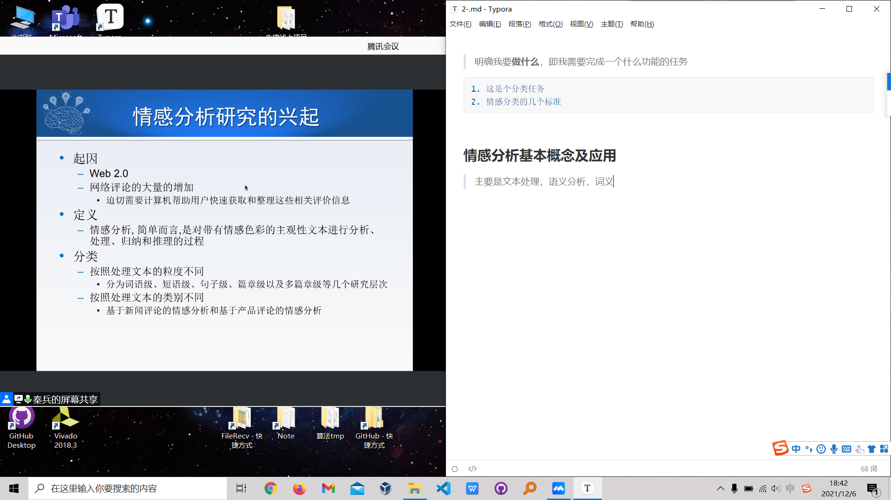

* 带有情感色彩的主观性文本（其实是相互的）
* 分析，处理，归纳，推理

研究工作的分类

* 粒度：词语级、短语级、句子级、篇章级、多篇章级
* 文本类别：新闻评论、社交媒体，和基于产品评论
  * 情绪：喜怒悲恐惊
  * 倾向性：褒贬中
  * 立场：中方和美方

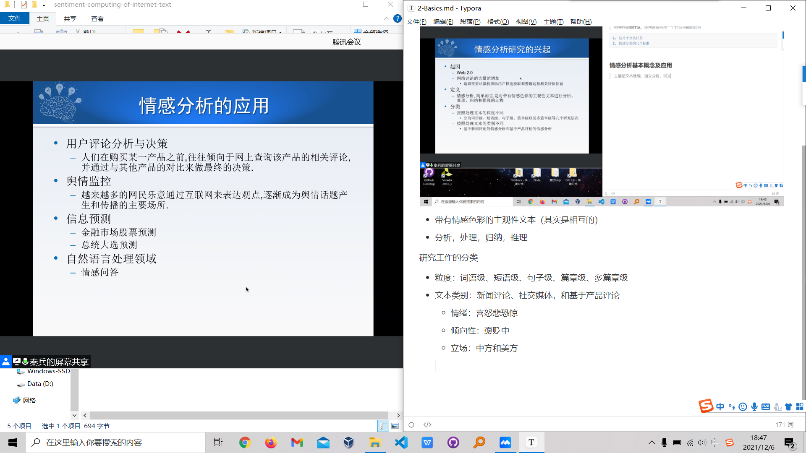

> 其实买东西基本不看好评，而是着重看差评，看差评原因，而不是好评和差评的比例

利用情感分析进行股票预测，其实属于人都能判断的东西，有什么做情感分析的必要吗？而且机器会被模棱两可的说法误导。

> 所以只是解决了信息数量级较大的时候自动化提取信息特征的作用？

情感陪伴：微软的小冰男/女友听说做的很好，已经有很好的成果的东西。

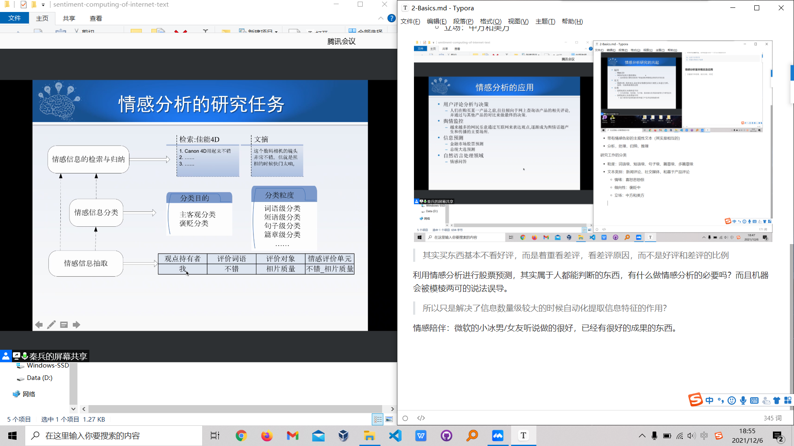


情感信息抽取

* 情感对象：评价的什么
* 评价词语：评价词如何与评价对象相对应（词法和句法语法分析应该能做到）
* 情感评价单元：上面两个
* 观点持有者：对于评论而言这是已知的；数据需要去隐私；这一点被淡化了（基本是已知的）
* 情感强度：十分好；一般

目的是做情感分类

* 分类目的

  * 主客观（明确是主观性文本才能做分析，因为才带有情感）
  * 褒贬分析

* 分类粒度

  略

> 到底为什么要做情感分析？（我的想法）
>
> 1. 快速获取论证逻辑
> 2. 实现自动化同一大描述对象关键信息提取，相当于是归纳

阅读论文的必要性：

1. 不同研究机构的着眼点不同，但基本流程是相同的

检索&文摘

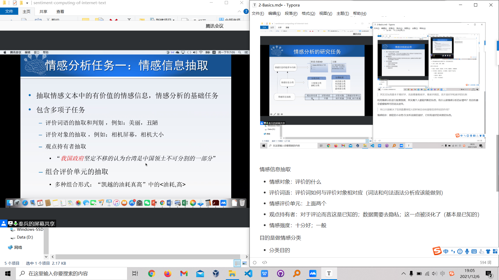

> 也就是，语法还是得学

**评价词语：评价某个评价对象某个方面的特征**

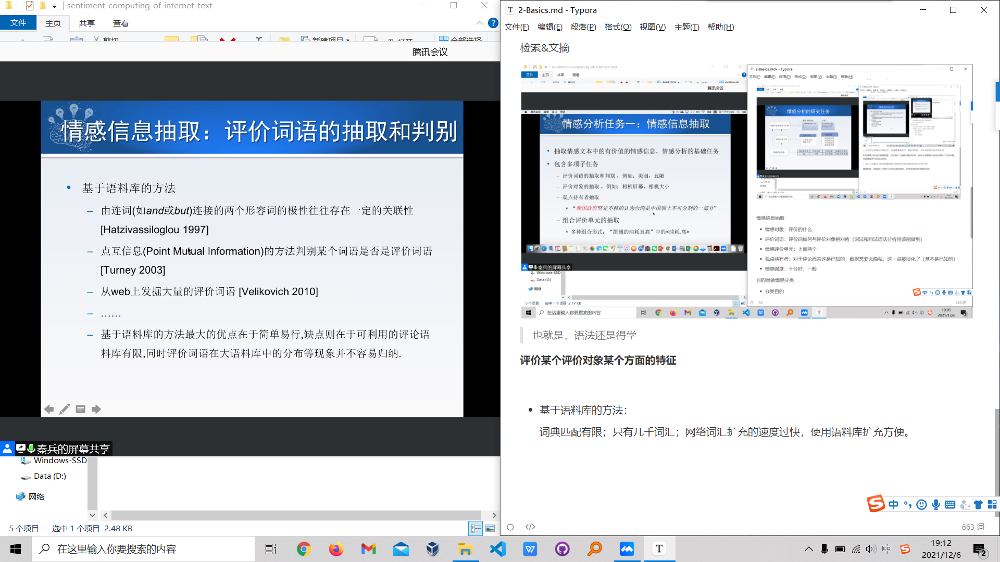

* 基于语料库的方法：

  词典匹配有限；只有几千词汇；网络词汇扩充的速度过快，使用语料库扩充方便。

  简单易行

  > 有相关工作可以看

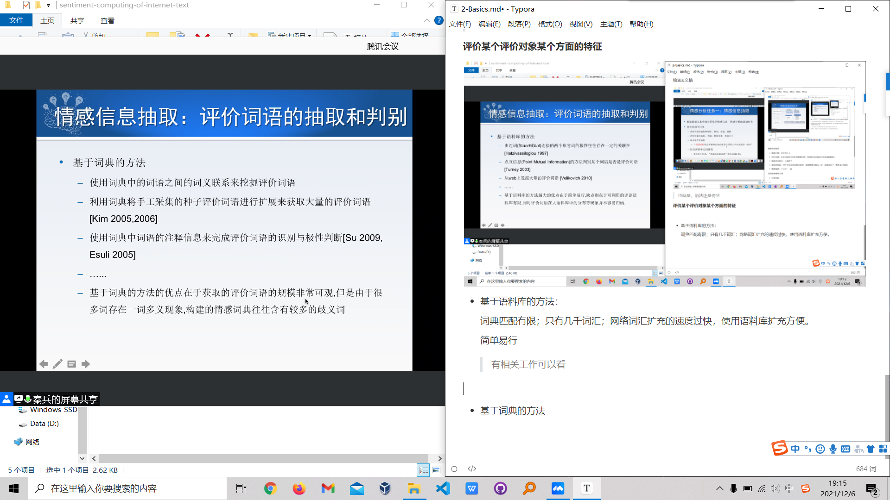

* 基于词典的方法

  > 艹，老师讲着讲着自己绕进去了

  规模够大，但是会有一词多义（歧义）

**评价对象的抽取**

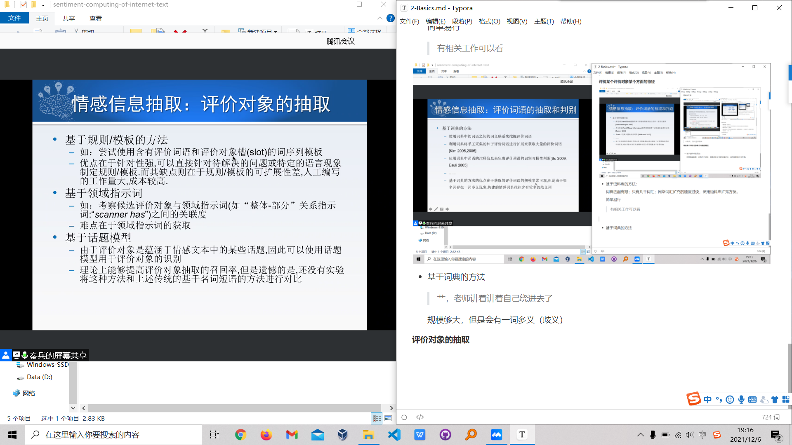

* 基于规则模板：人工工作量大
* 基于领域指示词
* 基于话题模型：理论上可以提高召回率，但缺乏工作

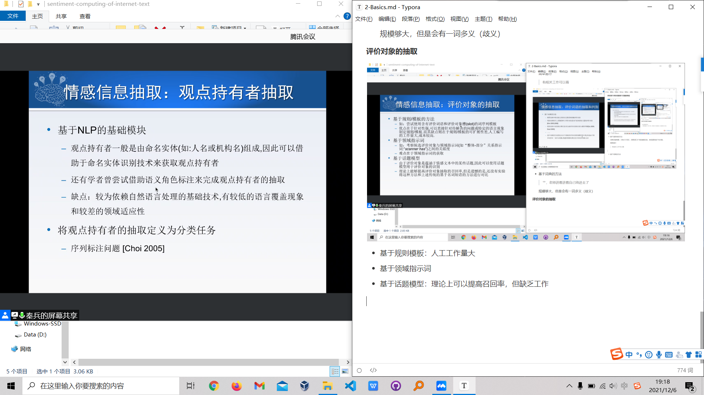

**观点持有者的抽取**

* 基于NLP的基础模块：


**评价单元的抽取**


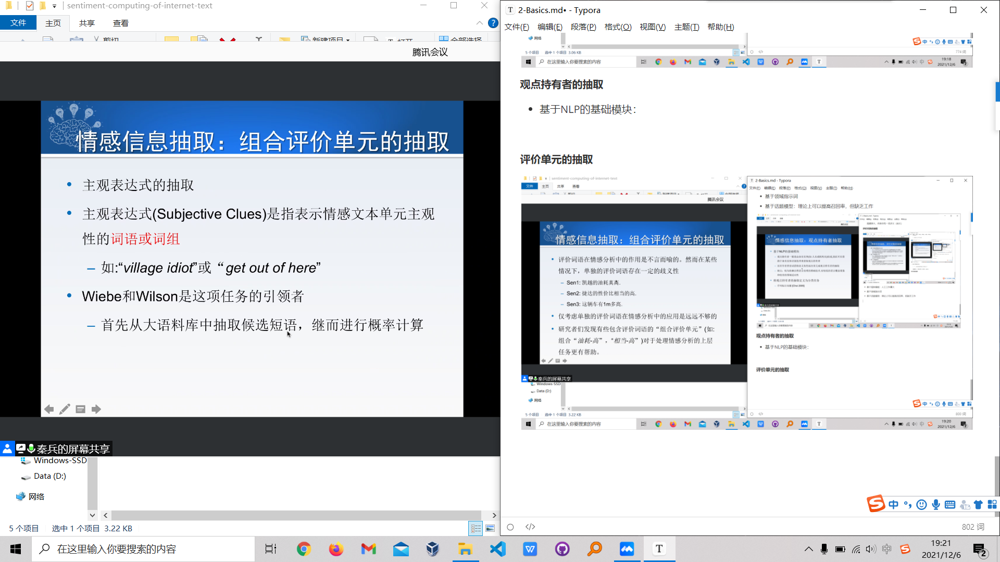

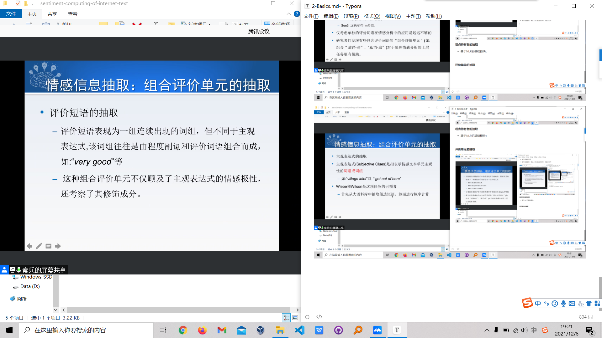

利用语义分析和句法分析

组合评价单元的抽取，意味着评价词语不一定连续出现

> 好家伙，直接全交给神经网络是吧。

神经网络对于句子的情感分析，不一定根据的是我们传统的方法，所以这只是传统机器学习的做法。

主客观信息分类

* 基于情感知识的方法

  依靠情感词典或者领域词典，以及主观文本中带有情感记性的组合评价单元加权计算

* 基于特征分类的方法

  机器学习方法，选取大量有意义的特征来完成分类

> 情感信息检索和归纳：整理信息

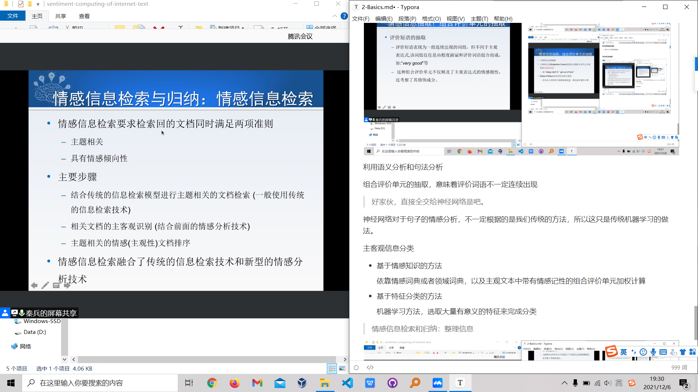

情感文摘

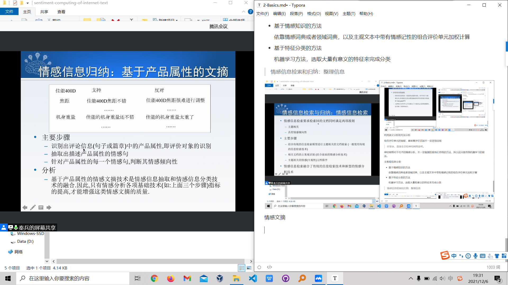

* 基于新闻评论的文摘

  目前从事相关的学者不多

  > 其实我开始有点感兴趣了

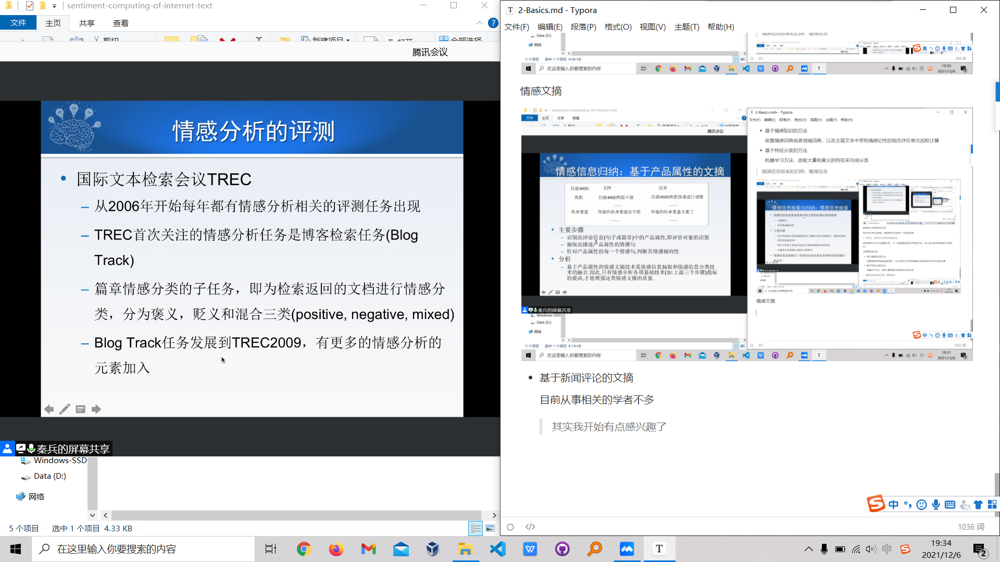

* 中文处理的困难，需要移植技术


微软小冰的男友


定位在真人其实不好


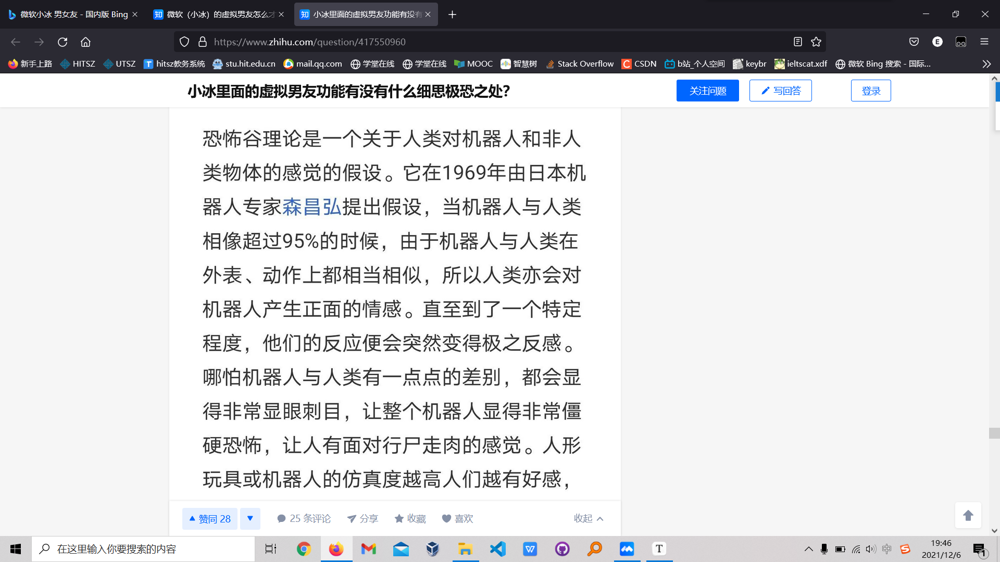

基于产品的情感分类，有什么问题？

主要是实现自动化处理，即使牺牲了质量，但数量巨大是确实的。

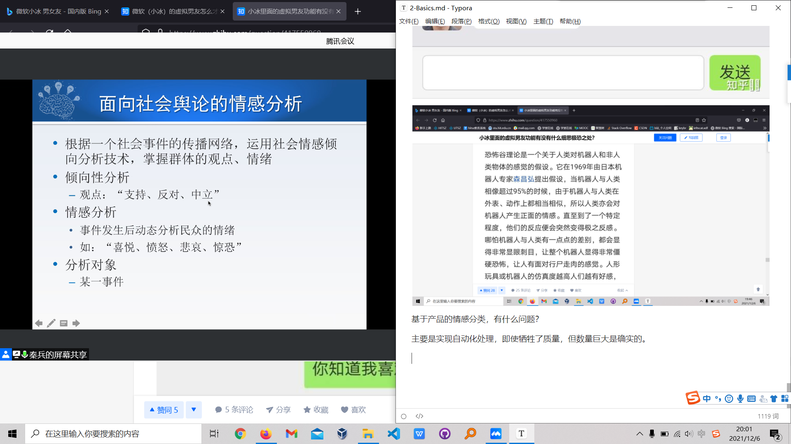


通过抽取博客上的内容来获取人们心情的变化，我觉的这个的意义很大。

美国东北大学、哈佛大学：Twitter Mood Map(Pulse of the Nation)

Facebook gross national happiness

* estimate each country's average happiness based on status updates
* apps/facebook.com/gnh_index


1. 读论文
2. 传统
3. 深度学习