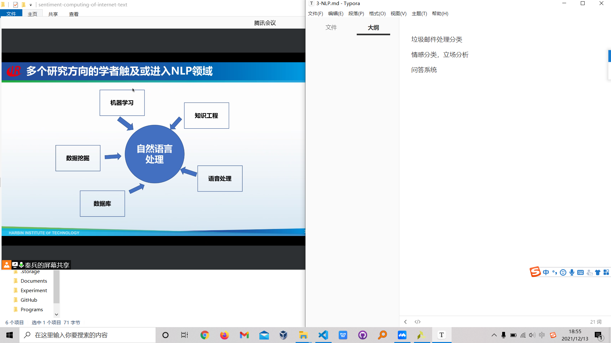
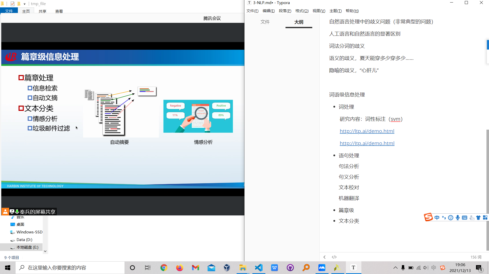
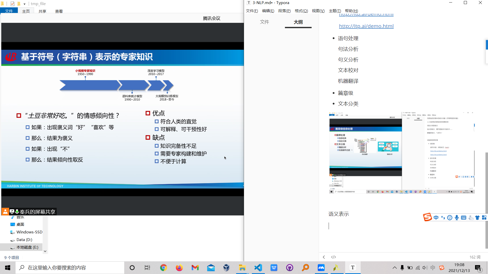
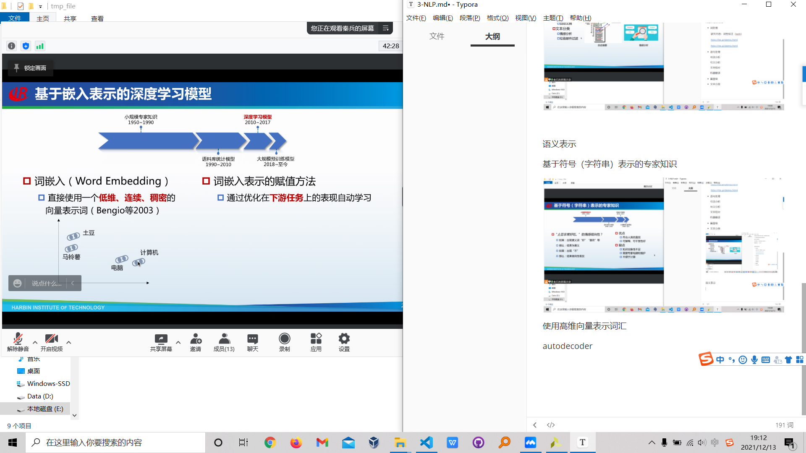
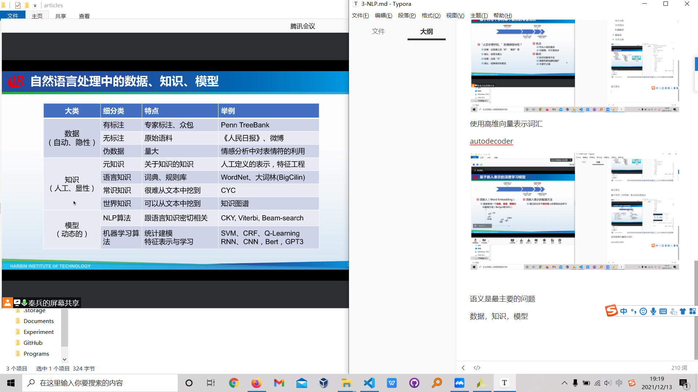
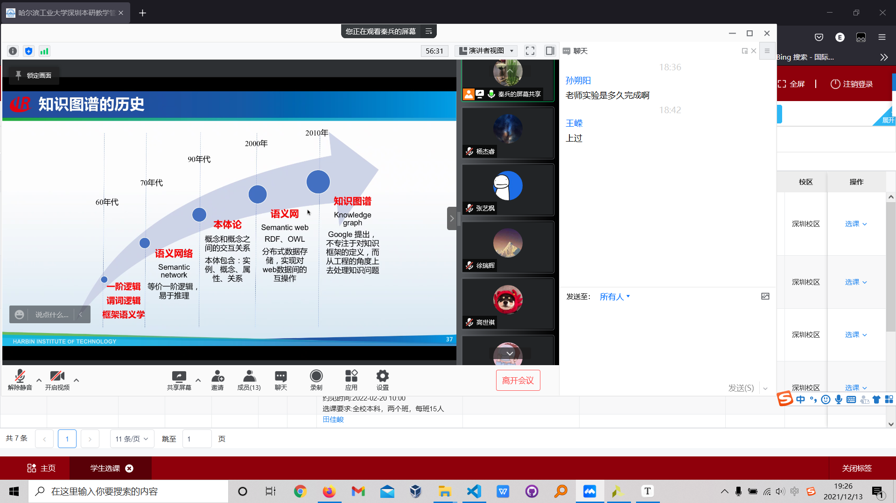
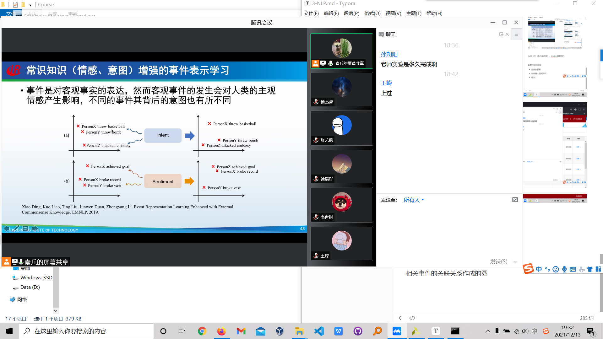

垃圾邮件处理分类

情感分类，立场分析

问答系统：本身的知识储备+网络爬虫

自然语言处理中的歧义问题（非常典型的问题）

人工语言和自然语言的显著区别

词法分词的歧义

语义的歧义，夏天能穿多少穿多少……

隐喻的歧义，“心肝儿”

词语级信息处理

* 词处理

​		研究内容：词性标注（svm）

​		http://ltp.ai/demo.html

​		http://Itp.ai/demo.html

* 语句处理

  句法分析

  句义分析

  文本校对

  机器翻译

* 篇章级
* 文本分类

语义表示

基于符号（字符串）表示的专家知识

使用高维向量表示词汇

autodecoder

语义是最主要的问题

数据，知识，模型

SVM, CRF（条件随机场），(makov随机场?)

新模式下的挑战：

* 数据的获取
* 如何融入领域知识
* 模型

知识图谱：

从人工，到爬取数据

事件图谱：

相关事件的关联关系作成的图

结构预测，匹配，分类

* 结构预测
* 匹配
* 分类
* 生成

清华九歌

高考机器人答题系统

回复生成存在的问题：无法根据上下文对结果进行判断

（transformer应该解决了啊？）

如何提升生成式回复的问题？

lstm=>transformer

聊天风格的修正

对话角色的一致性

自然语言处理的发展趋势

语义从符号表示=>分布表示

* 连续、低纬、稠密、动态的
* 词、短语、句子、篇章
* 便于计算语言单元之间的语义举例

=>特征工程

