Definition

Importance

* 判断文本的语义
* 主流算法基于机器学习

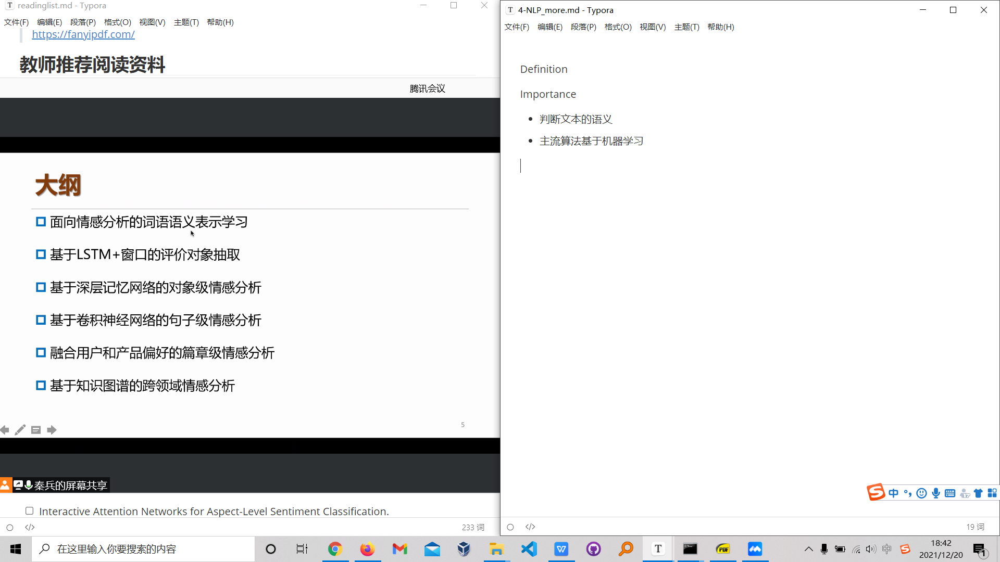

### word embedding

* 传统：one-hot representation
  * 每个词语都背表示成one-hot离散向量
  * 不能体现不同单词之间的关联
* Embedding
  * 连续的语义表示
  * $Harbin=(1.045, 0.912, -0.894, -1.053, 0.459)^{T}$

### 面向情感方向的词向量

* 传统词向量

> 高位矩阵而不是一个向量更好？三维，p,n,c

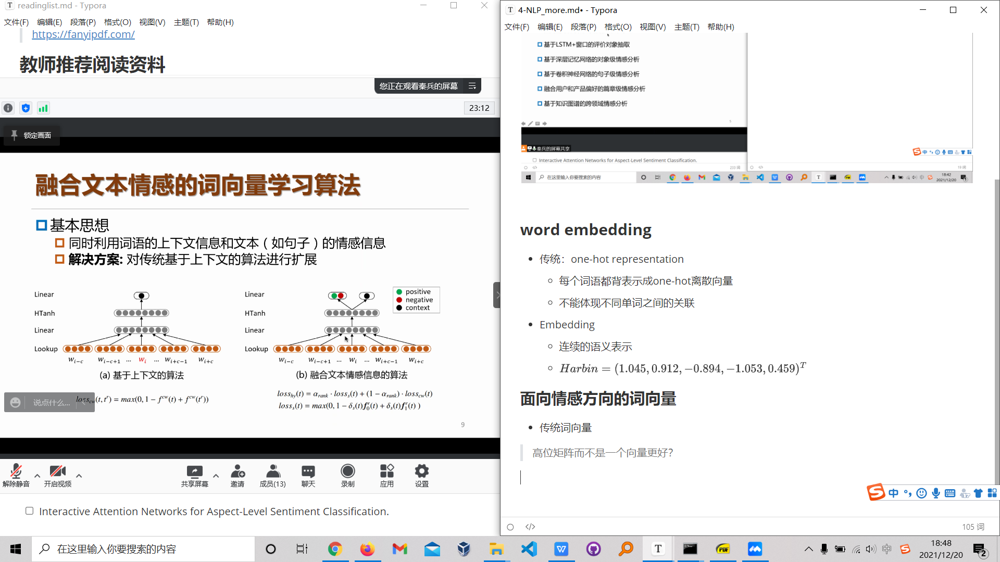

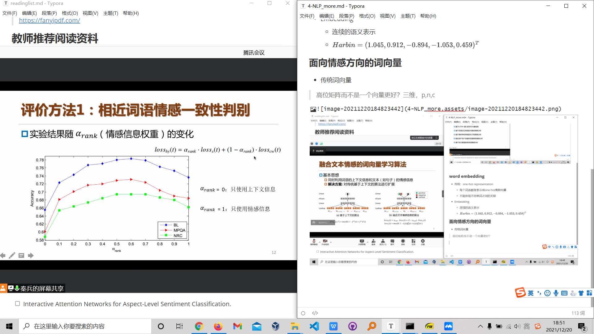

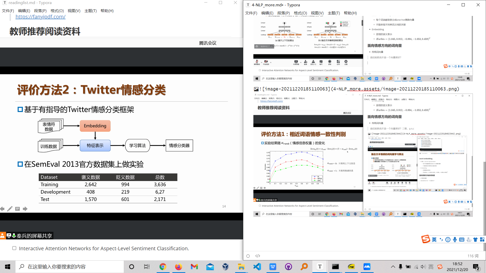

* 评价方法3：构建情感词典

	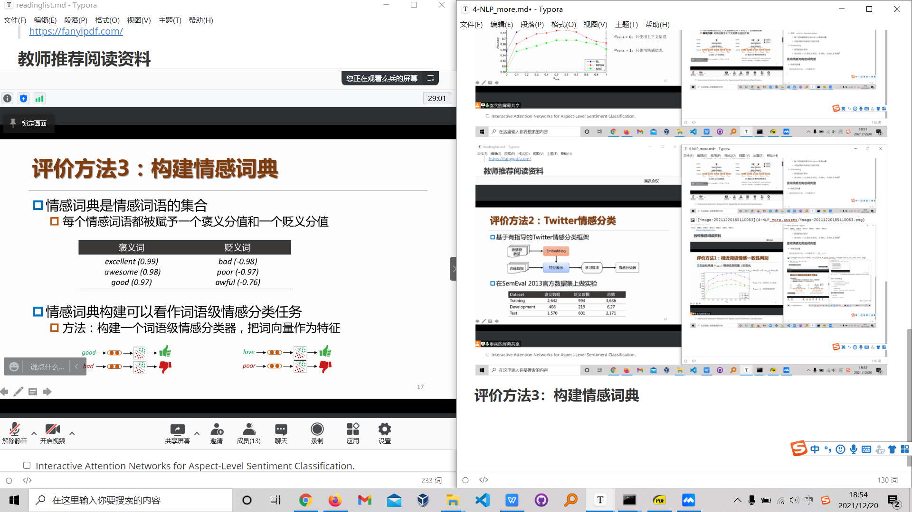
	
	自动构建词典
	
	情感词典规模
	
	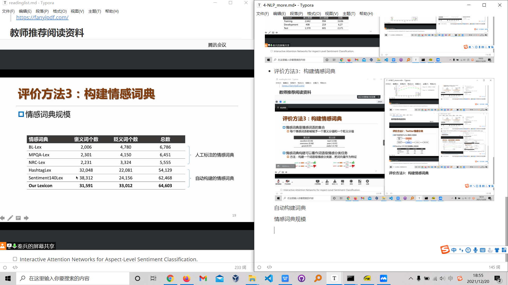

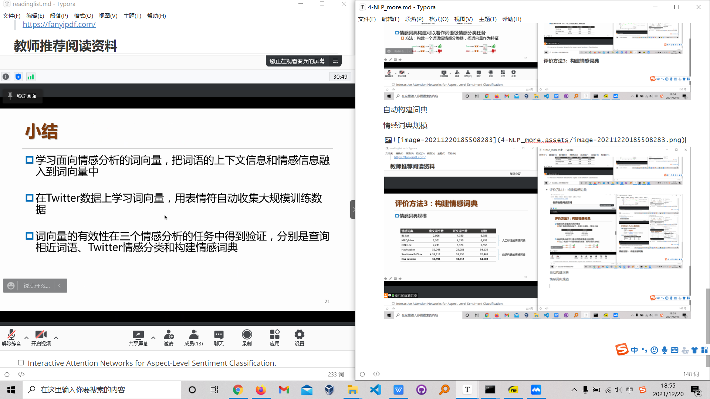

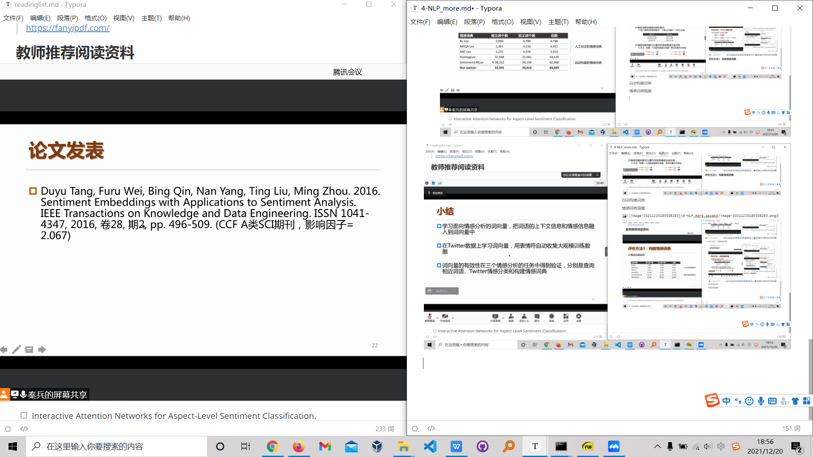

评价对象抽取

* 定义

  输入：带有情感的句子

  输出：句子包含的评价对象

* 已有工作

  基于句法规则匹配的算法

  基于机器学习方法（**序列标注问题**）：

  * 基特征的CRF（其实还有hmm，svm都可以做）

    需要人工手动找特征

  * 基于深度学习的方法

    * lstm

    * context-window(?cnn)

      基于窗口的简单前馈神经网络

  > 窗口？

* 基于记忆对象

  * 基于特征的SVM算法
  * 基于神经网络(lstm)

* Attention

  * attention+统计机器学习

> 词性标注+数据模板化

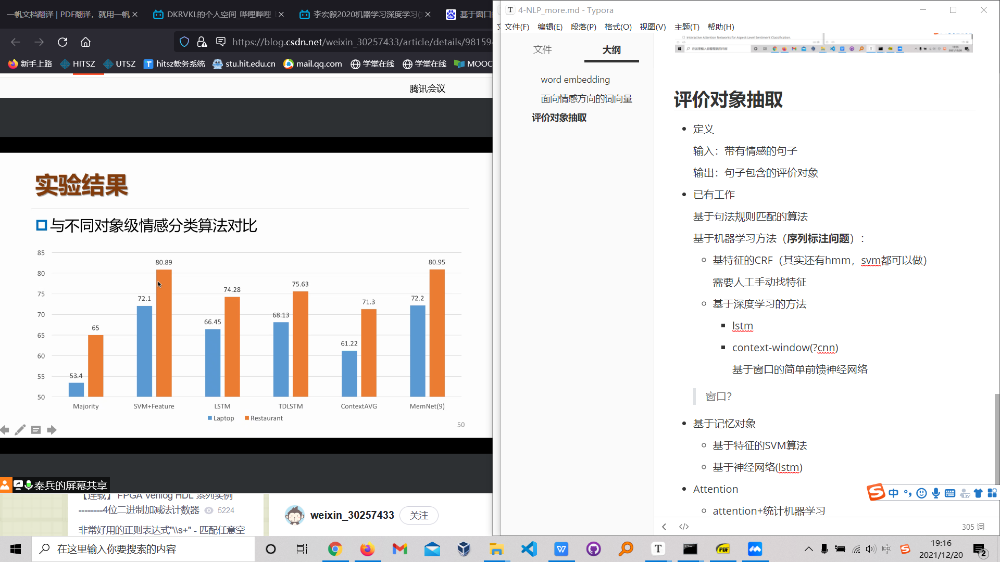

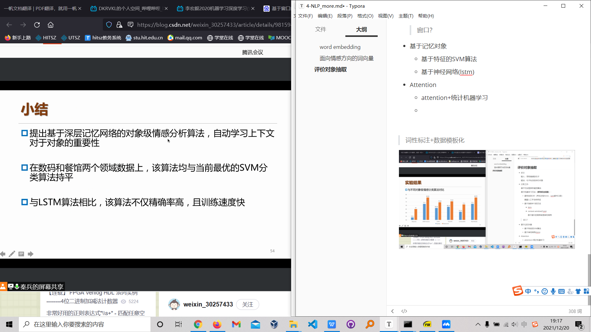

这里的主语是Attention

基于CNN的句子级别情感分析（只有这个详细讲了，我猜老师自己比较熟悉这个）

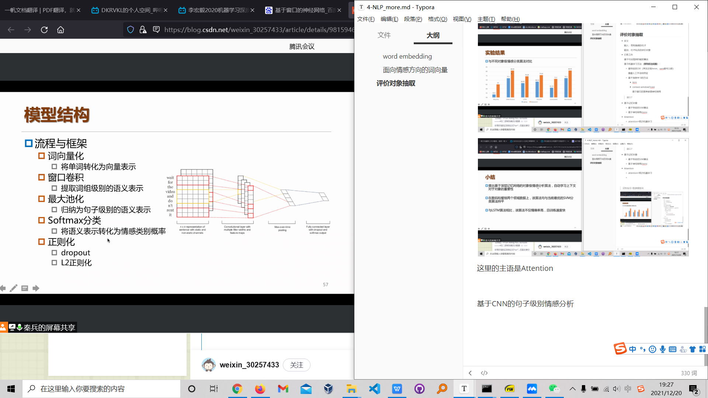

* 词向量化
* 将一句话拼接成矩阵
* padding统一长度

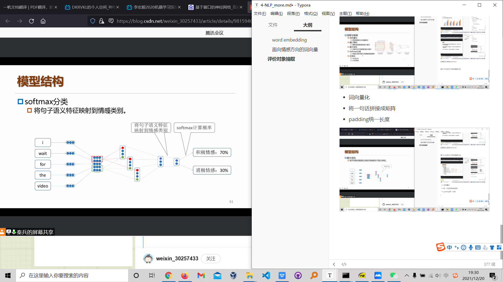

* 疑问：事实上正则化基本不会做，早停就可

> 好吧，这是个介绍性质的课程，不可能指望真的学到什么

篇章级别的情感分析

> 融合用户和产品偏好的篇章级别情感分析

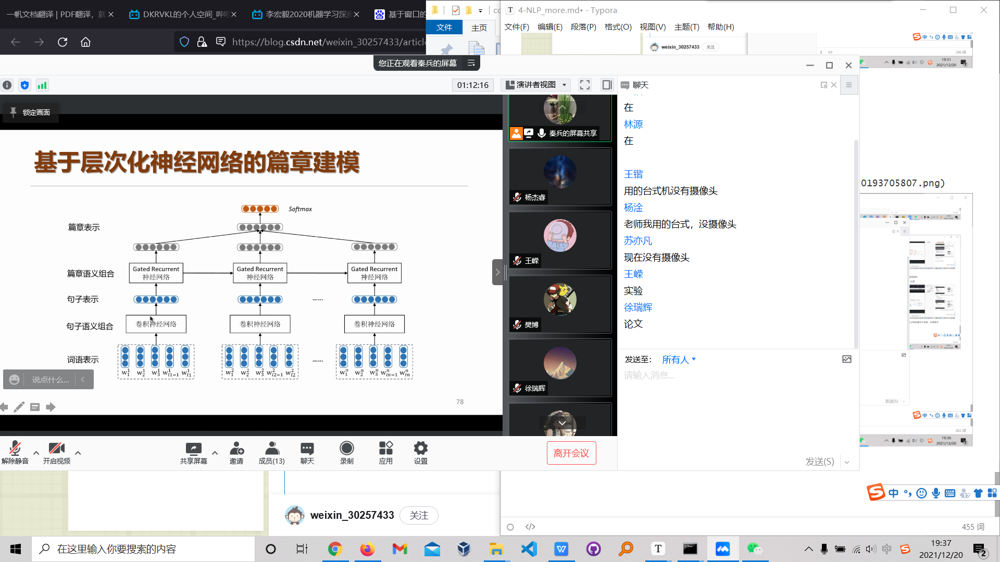

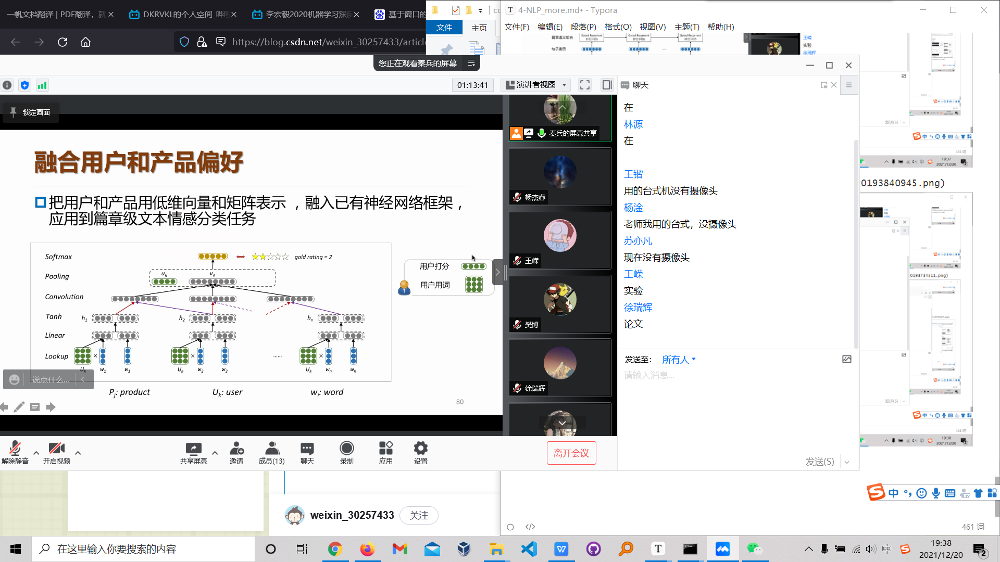

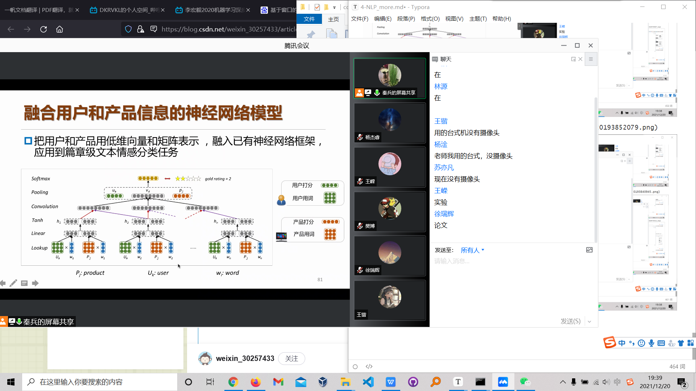

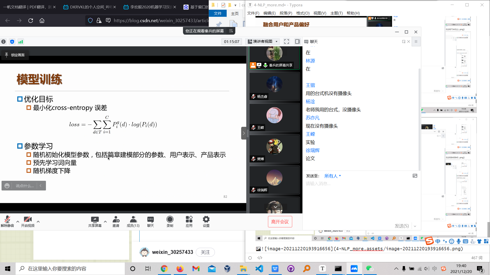

> 老师已经记不清楚卷积的单词了，GRU也认不到了

知识图谱

* 用于领域迁移

* 预训练模型（知识储备）

* 训练分类器（分类）

  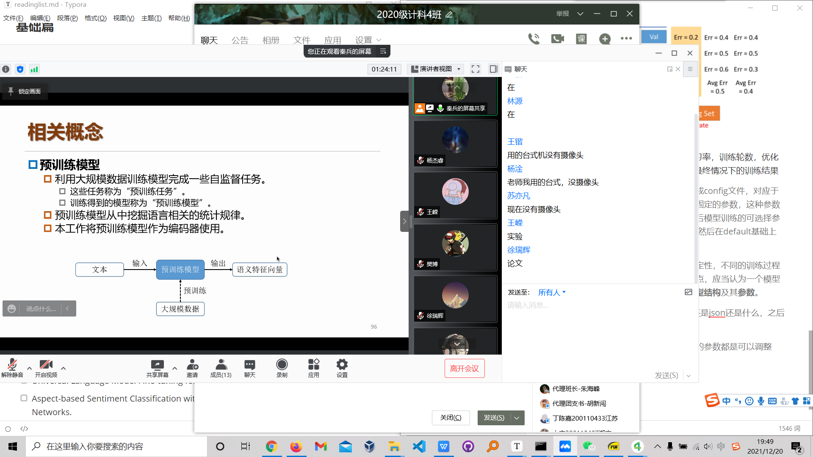

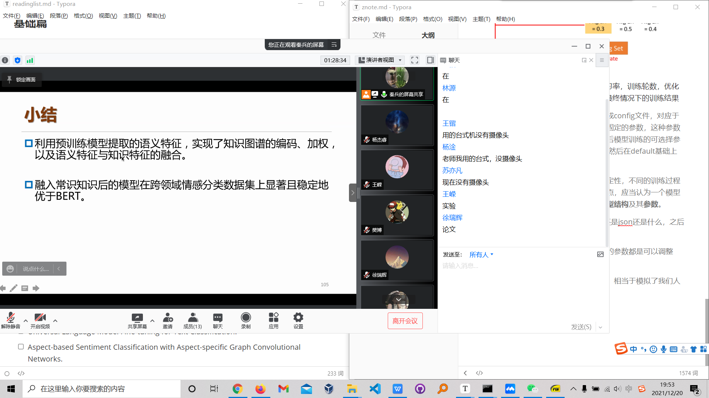